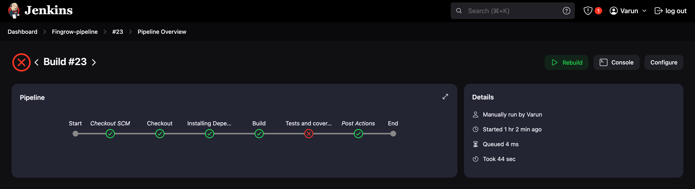
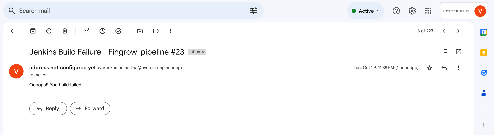
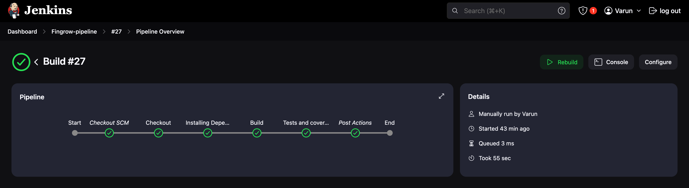
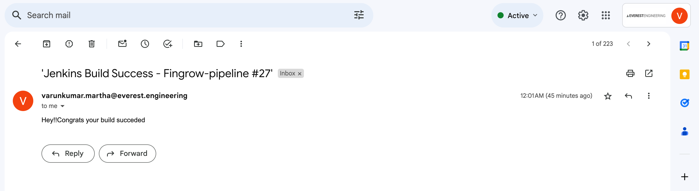

# FinGrow -- Jenkins


## System Requirements

1. Install Node.js on macOS.

   ```bash
   brew install node
   ```
2. Install watchman on macOS 
   ```bash
   brew install watchman
   ```
3. ### Jenkins Setup

    **Install and start Jenkins:**
        
        brew install jenkins-lts
        brew start services jenkins-lts


### Jenkins and GitHub Integration

1. **Integrate GitHub:**
   - Connect GitHub to Jenkins using a Personal Access Token (PAT).

### Create Jenkins Pipeline

1. **Pipeline Creation:**
   - Create a Jenkins Pipeline and add the GitHub repository with the specified branch using your GitHub credentials.
   - Implement stages for automated builds, test processes, and checks for code coverage thresholds.

### Email Notifications

1. **Configure Email Notifications:**

## Installation
#### Clone the Repo
   
   ```bash
   git clone -b fingrow-jenkins-ci/cd https://github.com/varun-everest/testing-fingrow
   ```
#### Install dependencies:
   - In Frontend : 

      ```bash
      cd frontend
      ```
   - Run following.

      ```bash
      npm install
      ```
## Here are some snapshots

## Build Failure 



## Build Fail Mail Notification



## Build Success


## Build Success Notification



### If you have any queries, feel free to reach out
```bash
   Email: varunkumar.martha@everest.engineering
```

### Thank You!! 😊